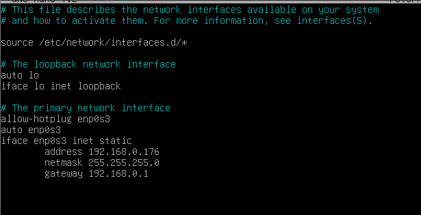
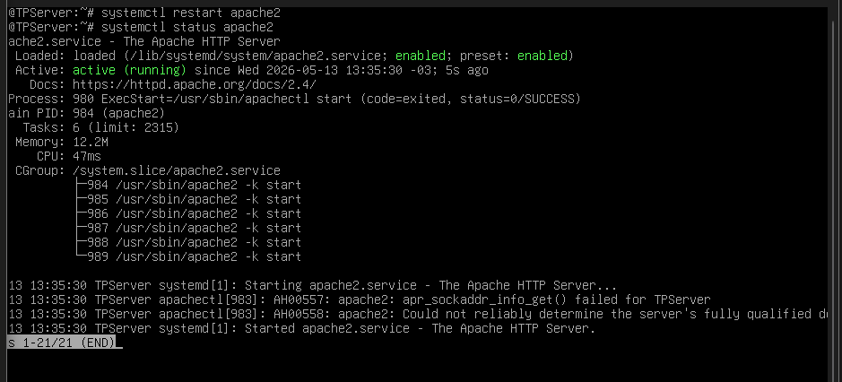
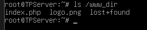

# 🖥️ TP Integrador — Computación Aplicada

**Universidad de Palermo**

---

## 👥 Integrantes del grupo

| Nombre |
|--------|
| Javier Valdez |
| Mateo Poggio |
| Emiliano Campos |

---

## 📋 Descripción del proyecto

Trabajo Práctico Integrador grupal de la materia **Computación Aplicada**. Consiste en la configuración completa de un servidor GNU/Linux Debian en una máquina virtual VirtualBox, abarcando servicios de red, web, base de datos, almacenamiento y automatización de backups.

---

## ✅ Consigna 1 — Configuración del entorno

### 1.2 — Blanqueo y cambio de contraseña root

La VM venía con contraseña de root desconocida. Se accedió al modo recovery desde el GRUB para blanquearla y luego se estableció la contraseña requerida por la consigna: `palermo`

> 📹 **Video:** `Blanqueo de root.webm` — se aprecia el proceso completo de blanqueo y cambio de contraseña.

### 1.3 — Hostname

Se configuró el nombre del servidor con:

```bash
hostnamectl set-hostname TPServer
hostname
```


---

## ✅ Consigna 2 — Servicios

### 2.1 — Actualización del SO a Debian 12

La VM venía con **Debian 11 (Bullseye)**. Antes de actualizar a Debian 12, fue necesario corregir problemas de resolución DNS y repositorios en `/etc/apt/sources.list`. Se realizó primero una actualización completa de Debian 11 para dejar el sistema estable:

```bash
apt update
apt upgrade -y
apt autoremove
```


Luego se modificaron los repositorios para apuntar a **Debian 12 (Bookworm)** y se inició la migración:

```bash
nano /etc/apt/sources.list
apt update
apt full-upgrade -y
reboot
```


Durante la actualización se reinstalaron componentes del sistema, incluyendo el gestor de arranque GRUB:


### 2.2 — SSH

Se instaló y configuró el servicio SSH. Se editó `/etc/ssh/sshd_config` habilitando el acceso root por clave pública:

```bash
apt-get install openssh-server -y
apt-get install nano -y
```


```bash
systemctl restart ssh
systemctl enable ssh
ssh-keygen
cat /root/.ssh/id_rsa.pub >> /root/.ssh/authorized_keys
```


### 2.3 — Servidor Web (Apache + PHP)

```bash
apt-get install apache2 php libapache2-mod-php -y
systemctl start apache2
systemctl enable apache2
```


Los archivos `index.php` y `logo.png` se obtuvieron descomprimiendo el material adicional provisto por la cátedra:

```bash
tar -xzvf /root/Material_Adicional_TPVMCA.tar.gz -C /root/
```


### 2.4 — Base de datos (MariaDB)

```bash
apt-get install mariadb-server -y
systemctl start mariadb
systemctl enable mariadb
mysql -u root < /root/Material_Adicional_TPVMCA/db.sql
mysql -u root -e "SHOW DATABASES;"
```


---

## ✅ Consigna 3 — Configuración de red

Se obtuvo la información de red con `ip a` e `ip route`:


Con esos datos se configuró una IP estática editando `/etc/network/interfaces`:

```
auto enp0s3
iface enp0s3 inet static
    address 192.168.0.176
    netmask 255.255.255.0
    gateway 192.168.0.1
```



```bash
systemctl restart networking
```

---

## ✅ Consigna 4 — Almacenamiento

### 4.1 — Nuevo disco

Se agregó un disco de **10 GB** desde la configuración de VirtualBox (Puerto SATA 3 → `sdc`).

> 📹 **Video:** `Agregando el nuevo disco 1.mp4` — muestra el proceso de agregar el disco desde VirtualBox.

### 4.2 — Particiones

Se crearon dos particiones estándar (tipo 83 - Linux) usando `fdisk /dev/sdc`:

| Partición | Tamaño | Directorio |
|-----------|--------|------------|
| `/dev/sdc1` | 3 GB | `/www_dir` |
| `/dev/sdc2` | 6 GB | `/backup_dir` |


Se formatearon con ext4:

```bash
mkfs.ext4 /dev/sdc1
mkfs.ext4 /dev/sdc2
```


Se crearon los directorios y se montaron:

```bash
mkdir /www_dir
mkdir /backup_dir
mount /dev/sdc1 /www_dir
mount /dev/sdc2 /backup_dir
```


### 4.3 — Archivos web en `/www_dir`

Se copiaron `index.php` y `logo.png` a la nueva partición y se actualizó la configuración de Apache apuntando el `DocumentRoot` a `/www_dir`:

```bash
cp /root/Material_Adicional_TPVMCA/index.php /www_dir/
cp /root/Material_Adicional_TPVMCA/logo.png /www_dir/
```

`/etc/apache2/sites-available/000-default.conf`:
```apache
<VirtualHost *:80>
    DocumentRoot /www_dir
</VirtualHost>
```

En `/etc/apache2/apache2.conf` se agregaron permisos:
```apache
<Directory /www_dir>
    Options Indexes FollowSymLinks
    AllowOverride None
    Require all granted
</Directory>
```

```bash
systemctl restart apache2
```




### 4.4 y 4.5 — Montaje automático (fstab)

El archivo `/etc/fstab` es una lista que Linux lee **cada vez que arranca** y monta automáticamente los discos listados. Se agregaron las entradas usando los UUID de cada partición:

```bash
echo "UUID=$(blkid -s UUID -o value /dev/sdc1)  /www_dir  ext4  defaults  0  2" >> /etc/fstab
echo "UUID=$(blkid -s UUID -o value /dev/sdc2)  /backup_dir  ext4  defaults  0  2" >> /etc/fstab
mount -a
reboot
```


Resultado tras el reboot:


### Nota — Archivo de particiones

```bash
cat /proc/partitions > /opt/particion
```


---

## ✅ Consigna 5 — Backup

### 5.1 a 5.6 — Script `backup_full.sh`

```bash
mkdir /opt/scripts
nano /opt/scripts/backup_full.sh
chmod +x /opt/scripts/backup_full.sh
```


El script:
- Acepta argumentos `<origen>` y `<destino>`
- Incluye opción `-help`
- Valida que los directorios existan antes de ejecutar
- Genera archivos con la fecha en formato ANSI (`YYYYMMDD`), por ejemplo: `log_bkp_20260513.tar.gz`

Prueba de ejecución:


### 5.7 — Cron

```bash
crontab -e
```


Tareas configuradas:

```
# Todos los días a las 00:00 → backup de /var/log
0 0 * * * /opt/scripts/backup_full.sh /var/log /backup_dir

# Lunes, miércoles y viernes a las 23:00 → backup de /www_dir
0 23 * * 1,3,5 /opt/scripts/backup_full.sh /www_dir /backup_dir
```


---

## 📁 Estructura del repositorio

```
/
├── README.md
├── images/               ← capturas de evidencia
├── root.tar.gz
├── etc.tar.gz
├── opt.tar.gz
├── www_dir.tar.gz
├── backup_dir.tar.gz
└── var/                  ← spliteado en partes pequeñas
```
