# 🖥️ TP Integrador — Computación Aplicada

**Universidad de Palermo**

---

## 👥 Integrantes del grupo

| Nombre |
|--------|
| Javier Valdez |
| Mateo Poggio |
| Emiliano Campos |

---

## 📋 Descripción del proyecto

Trabajo Práctico Integrador grupal de la materia **Computación Aplicada**. Consiste en la configuración completa de un servidor GNU/Linux Debian en una máquina virtual VirtualBox, abarcando servicios de red, web, base de datos, almacenamiento y automatización de backups.

---

## ✅ Consigna 1 — Configuración del entorno

### 1.2 — Blanqueo y cambio de contraseña root

Arrancamos por **blanquear el root**, porque la contraseña inicial era desconocida. Se accedió al modo recovery desde el GRUB para blanquearla y luego se configuró la contraseña pedida por la consigna: `palermo`

> 📹 **Video:** `images/Blanqueo_de_root.webm` — se aprecia el proceso completo de blanqueo y cambio de contraseña.

### 1.3 — Hostname

Después configuramos el hostname de la máquina:

```bash
hostnamectl set-hostname TPServer
hostname
```

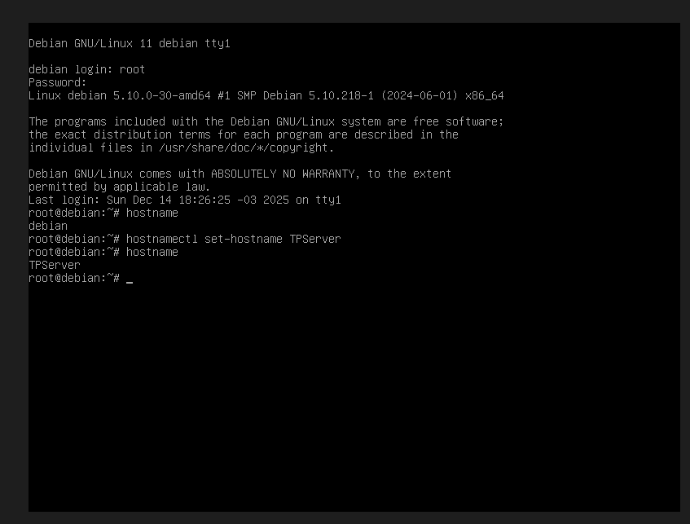

---

## ✅ Consigna 2 — Servicios

### 2.1 — Actualización del SO a Debian 12

Al momento de actualizar el sistema nos encontramos con algunos problemas. La VM venía con **Debian 11**, y cuando intentamos actualizar directamente tuvimos inconvenientes con la resolución de DNS y con los repositorios configurados en `/etc/apt/sources.list`, así que primero tuvimos que corregir eso.

Por ese motivo, primero realizamos una **actualización completa de Debian 11** para dejar el sistema estable y consistente:

```bash
apt update
apt upgrade -y
apt autoremove
```

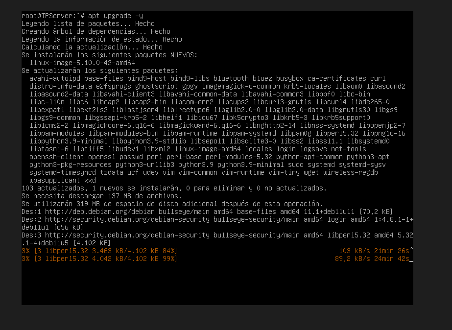
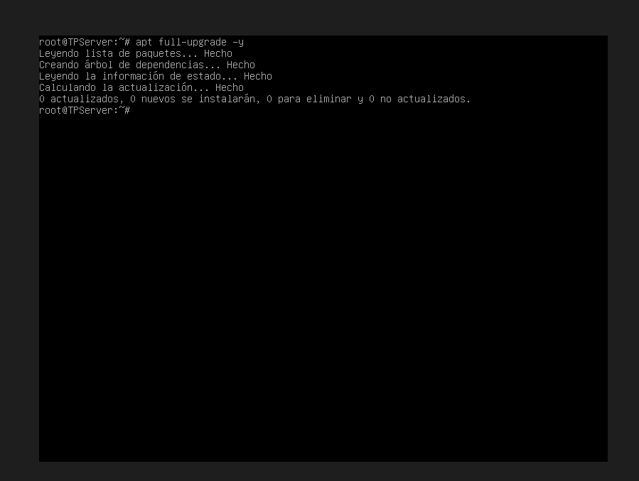

Una vez resuelto eso, modificamos los repositorios para apuntar a **Debian 12 (Bookworm)** y recién ahí iniciamos la actualización:

```bash
nano /etc/apt/sources.list
apt update
apt full-upgrade -y
reboot
```

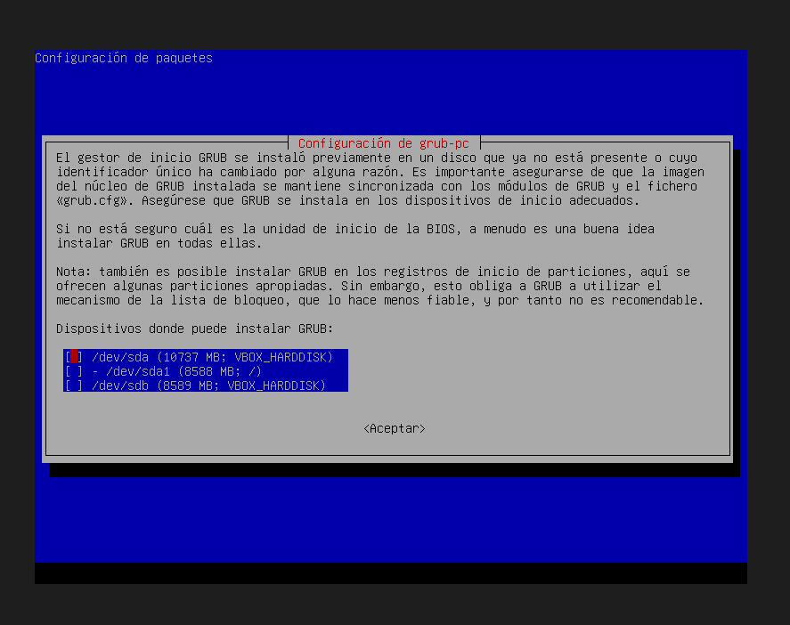
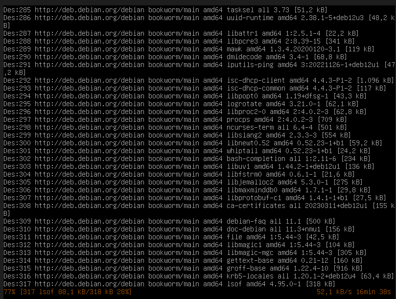
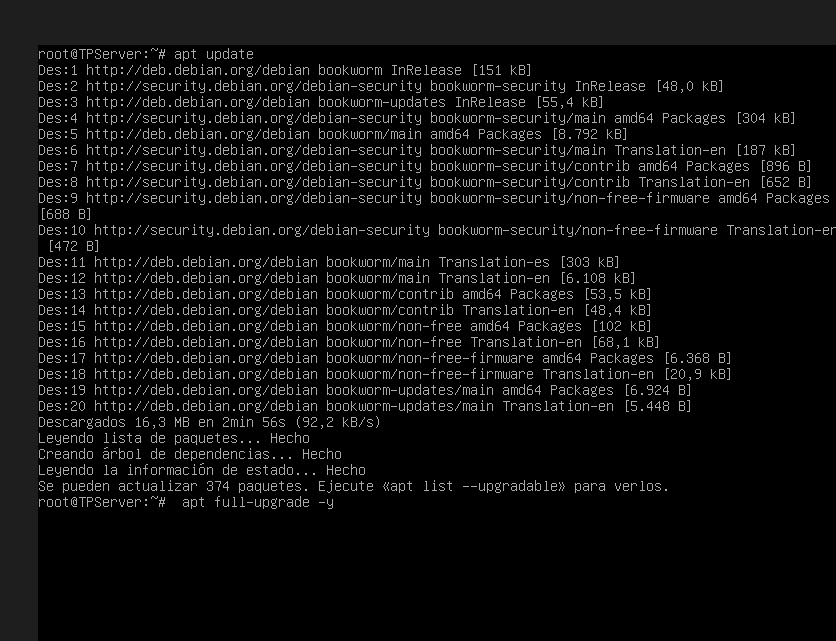

Durante la actualización se reinstalaron componentes del sistema, incluyendo el gestor de arranque GRUB:


### 2.2 — SSH

Volviendo a la terminal desde el root, lo que tocaba hacer según la consigna era instalar SSH. Pero primero instalamos nano para trabajar más cómodamente:

```bash
apt-get install nano -y
apt-get install openssh-server -y
```

Se editó `/etc/ssh/sshd_config` habilitando:
- `PermitRootLogin yes`
- `PubkeyAuthentication yes`

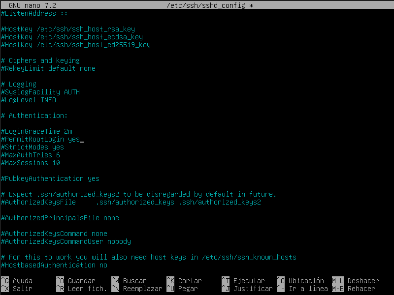

```bash
systemctl restart ssh
systemctl enable ssh
ssh-keygen
cat /root/.ssh/id_rsa.pub >> /root/.ssh/authorized_keys
```

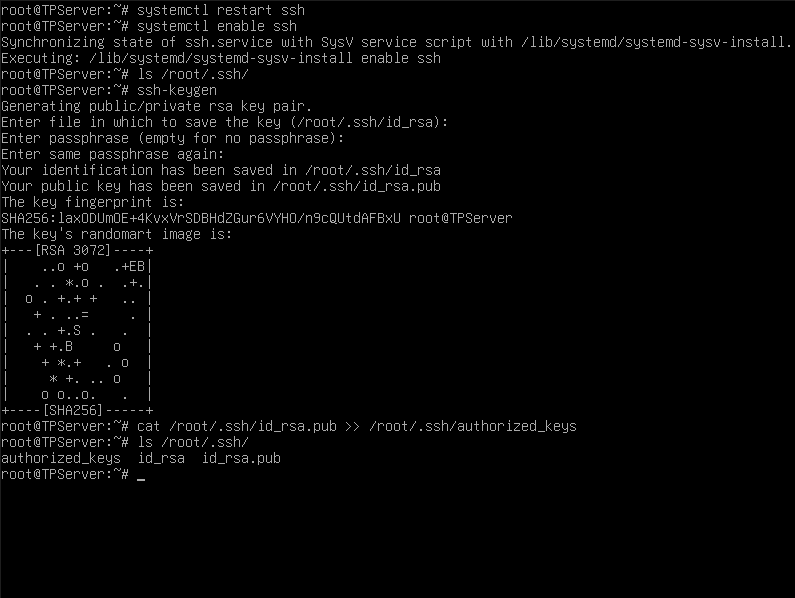

### 2.3 — Servidor Web (Apache + PHP)

Con todo lo anterior listo, procedimos a instalar Apache y PHP:

```bash
apt-get install apache2 php libapache2-mod-php -y
systemctl start apache2
systemctl enable apache2
```

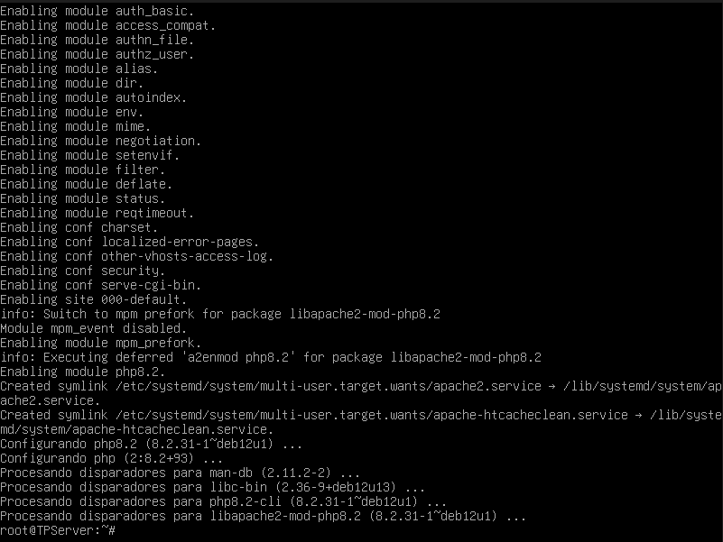

Descomprimimos la carpeta `Material_Adicional_TPVMCA` para acceder a los archivos con los que íbamos a trabajar:

```bash
tar -xzvf /root/Material_Adicional_TPVMCA.tar.gz -C /root/
```

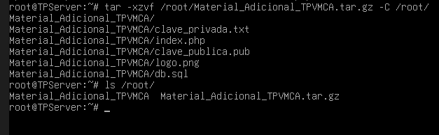

### 2.4 — Base de datos (MariaDB)

```bash
apt-get install mariadb-server -y
systemctl start mariadb
systemctl enable mariadb
mysql -u root < /root/Material_Adicional_TPVMCA/db.sql
mysql -u root -e "SHOW DATABASES;"
```

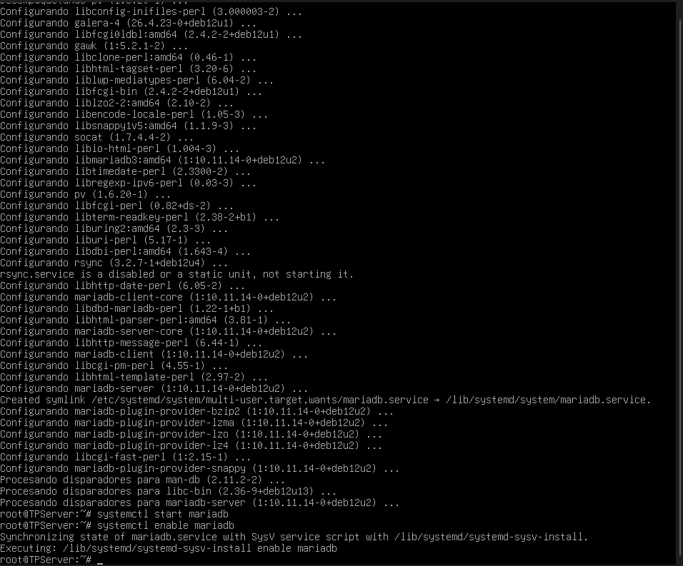
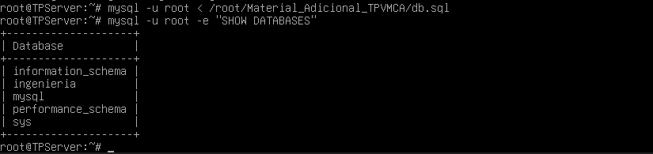

---

## ✅ Consigna 3 — Configuración de red

Con la instalación de servicios completa, pasamos a la consigna 3. Obtuvimos los datos de red con `ip a` e `ip route`:

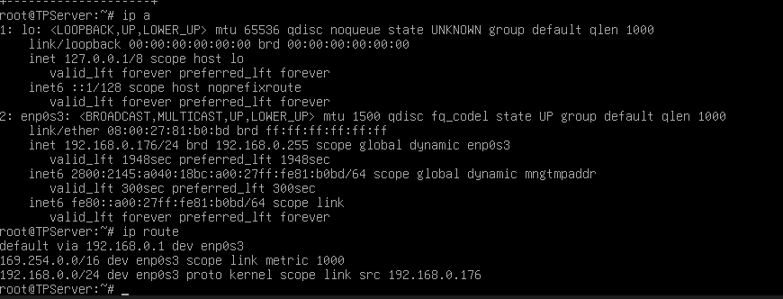

Con esos datos configuramos una IP estática editando `/etc/network/interfaces`:

```
auto enp0s3
iface enp0s3 inet static
    address 192.168.0.176
    netmask 255.255.255.0
    gateway 192.168.0.1
```


```bash
systemctl restart networking
```

---

## ✅ Consigna 4 — Almacenamiento

### 4.1 — Nuevo disco

Se agregó un disco de **10 GB** adicional desde la configuración de VirtualBox (Puerto SATA 3 → `sdc`).

> 📹 **Video:** `images/Agregando_el_nuevo_disco_1.mp4` — muestra el proceso de agregar el disco desde VirtualBox con la VM apagada.

### 4.2 — Particiones (tipo 83)

Se crearon dos particiones estándar **(tipo 83 - Linux)** usando `fdisk /dev/sdc`:

| Partición | Tamaño | Directorio |
|-----------|--------|------------|
| `/dev/sdc1` | 3 GB | `/www_dir` |
| `/dev/sdc2` | 6 GB | `/backup_dir` |

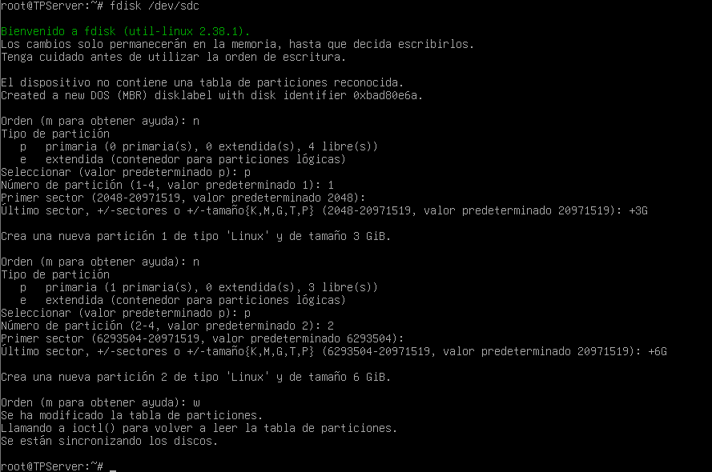

Se formatearon con ext4:

```bash
mkfs.ext4 /dev/sdc1
mkfs.ext4 /dev/sdc2
```

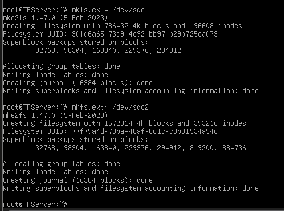

Creamos las carpetas correspondientes y montamos:

```bash
mkdir /www_dir
mkdir /backup_dir
mount /dev/sdc1 /www_dir
mount /dev/sdc2 /backup_dir
```

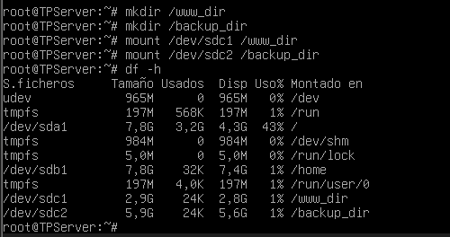

Verificación final del tipo de partición (tipo 83 - Linux):

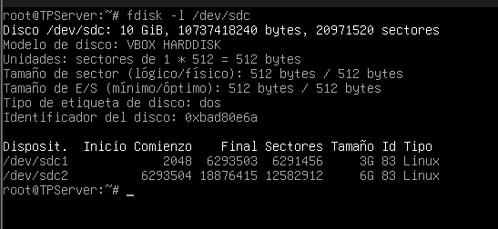

### 4.3 — Archivos web en `/www_dir`

Se copiaron `index.php` y `logo.png` a la nueva partición y se actualizó la configuración de Apache apuntando el `DocumentRoot` a `/www_dir`:

```bash
cp /root/Material_Adicional_TPVMCA/index.php /www_dir/
cp /root/Material_Adicional_TPVMCA/logo.png /www_dir/
```

`/etc/apache2/sites-available/000-default.conf`:
```apache
<VirtualHost *:80>
    DocumentRoot /www_dir
</VirtualHost>
```

En `/etc/apache2/apache2.conf` se agregaron permisos para el nuevo directorio:
```apache
<Directory /www_dir>
    Options Indexes FollowSymLinks
    AllowOverride None
    Require all granted
</Directory>
```

Al intentar acceder al sitio web, Apache devolvía un error **403 Forbidden** por falta de permisos:

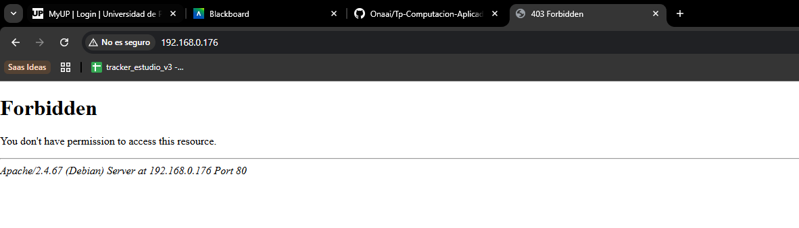

Se corrigieron los permisos y la configuración:

```bash
chmod 755 /www_dir
chown -R www-data:www-data /www_dir
apt-get install php-mysqli -y
systemctl restart apache2
```

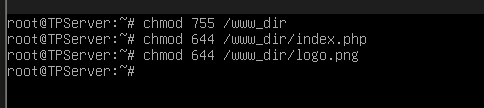

La página aparecía en blanco porque faltaba el módulo `php-mysqli`. Una vez instalado:

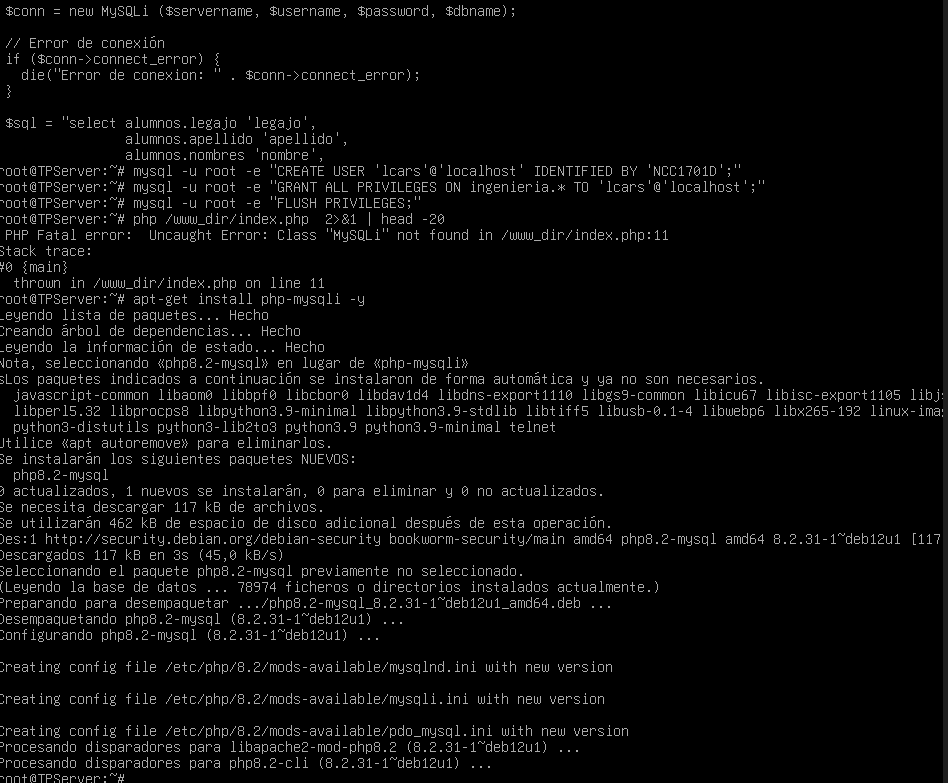

El sitio web quedó funcionando correctamente, mostrando los datos de alumnos desde la base de datos:

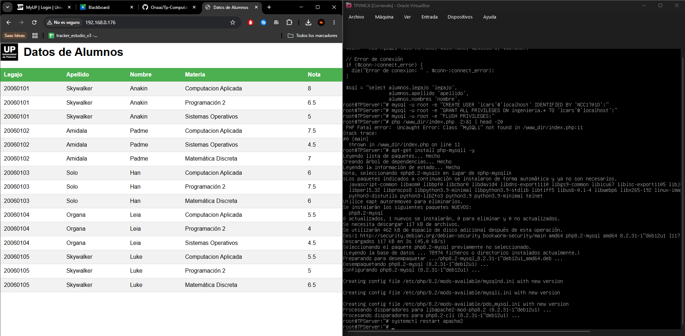

### 4.4 y 4.5 — Montaje automático (fstab)

El archivo `/etc/fstab` es una lista que Linux lee **cada vez que arranca**, y monta automáticamente los discos que están listados ahí. Sin esto, las particiones `/www_dir` y `/backup_dir` existirían pero quedarían vacías y sin conectar al sistema cada vez que reiniciás.

Lo que hicimos fue:
- Agregar las dos líneas con el UUID de cada partición → así Linux las identifica aunque cambien de nombre
- El `mount -a` recarga el fstab sin reiniciar, para verificar que está bien escrito
- El `reboot` es para confirmar que arrancan solas al inicio

```bash
echo "UUID=$(blkid -s UUID -o value /dev/sdc1)  /www_dir  ext4  defaults  0  2" >> /etc/fstab
echo "UUID=$(blkid -s UUID -o value /dev/sdc2)  /backup_dir  ext4  defaults  0  2" >> /etc/fstab
mount -a
reboot
```

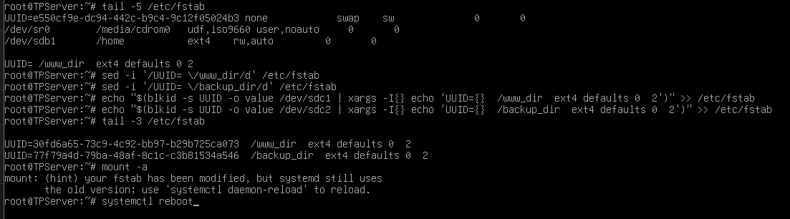

Así quedó después del reboot:

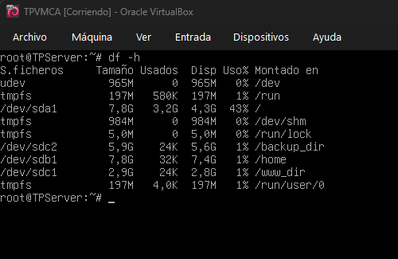

### Nota — Archivo de particiones

```bash
cat /proc/partitions > /opt/particion
```

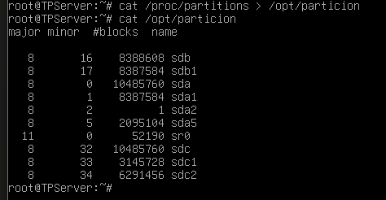

---

## ✅ Consigna 5 — Backup

### 5.1 a 5.6 — Script `backup_full.sh`

```bash
mkdir /opt/scripts
nano /opt/scripts/backup_full.sh
chmod +x /opt/scripts/backup_full.sh
```

El script cumple con todos los requisitos de la consigna:
- Acepta argumentos `<origen>` y `<destino>`
- Incluye opción `-help` para guiar al usuario
- Valida que los directorios de origen y destino existan antes de ejecutar
- Genera archivos con la fecha en formato ANSI (`YYYYMMDD`), por ejemplo: `log_bkp_20260513.tar.gz`

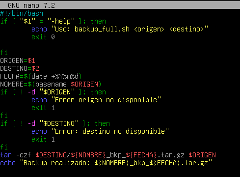

Prueba de ejecución exitosa:

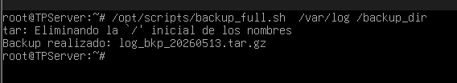

### 5.7 — Cron

Se configuraron las tareas automáticas con `crontab -e`:

```bash
crontab -e
```

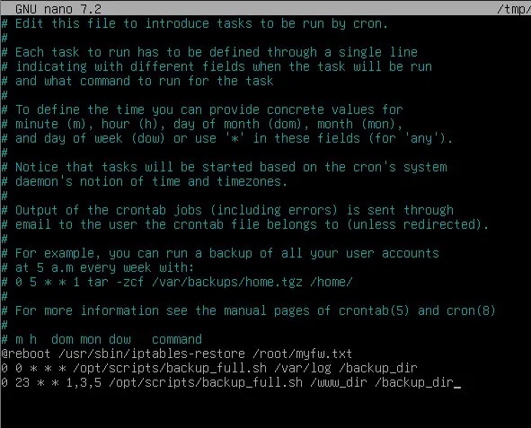

```
# Todos los días a las 00:00 → backup de /var/log
0 0 * * * /opt/scripts/backup_full.sh /var/log /backup_dir

# Lunes, miércoles y viernes a las 23:00 → backup de /www_dir
0 23 * * 1,3,5 /opt/scripts/backup_full.sh /www_dir /backup_dir
```

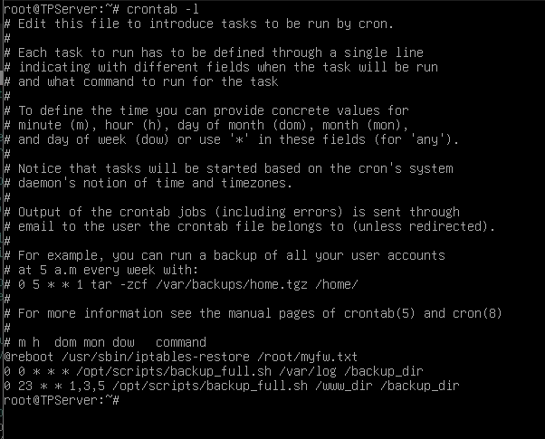

---

## ✅ Consigna 6 — GitHub

Repositorio creado en GitHub con toda la documentación, imágenes y videos de evidencia, y los directorios del servidor comprimidos.

---

## 📁 Estructura del repositorio

```
/
├── README.md
├── images/               ← capturas de evidencia y videos
├── root.tar.gz
├── etc.tar.gz
├── opt.tar.gz
├── www_dir.tar.gz
├── backup_dir.tar.gz
└── var/                  ← spliteado en partes pequeñas
```
